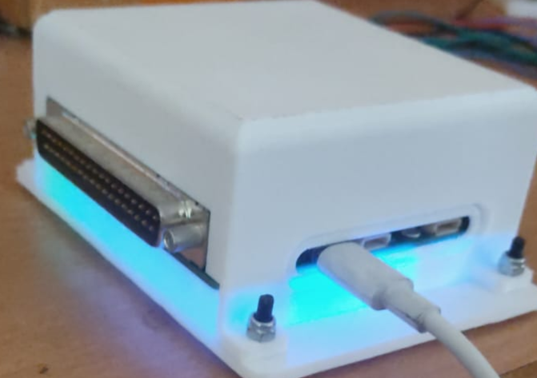

# Firmware for Samyak V2


### Hardware Details
The board is built on the Pixhawk's FMU-v6C standard with very minimal changes.

### Structure of this repository

```bash
.
├── assets 
├── bin
│   ├── ardupilot #ardupilot fw/bootloader binaries
│   │   ├── arducopter_with_bl_8MHz.hex
│   │   ├── iomcu_bl.bin
│   │   └── iomcu_f103_8MHz_bl.bin
│   └── px4 #px4 fw binaries
│       └── px4_fmu-v6c_default.elf
├── configs
│   ├── ardupilot #ardupilot config files
│   │   ├── defaults.parm
│   │   ├── hwdef-bl.dat
│   │   └── hwdef.dat
│   └── px4 # px4 not supported yet..
├── docs # detailed hardware documentation for ref
├── schematics # hardware schematics
└── README.md
```

### Steps to build firmware:

#### 1. ArduPilot
##### 1.1 Configurations
ArduPilot uses ``.dat`` files (similar to ``.ioc`` files in CubeIDE) to list pin mappings for MCU, and other configurations. This is done to make the source code platform agnostic.

The files for Samyak-v2 are listed under ``configs/ardupilot/`` are self explainatory, for more details one can refer to Step 6 of the official guide [here](https://ardupilot.org/dev/docs/porting.html).

##### 1.2 Building Firmware
Once done writing both the config files (for MCU firmware - ``hwdef.dat`` and bootloader - ``hwdef_bl.dat`` respectively). We proceed to build the firmware.

Follow the following steps:

1. Clone ArduPilot repository : ``git clone https://github.com/ArduPilot/ardupilot -- recursive && cd ardupilot``
2. Initialize submodules (if not initialized already via ``--recusive``) : ``git submodule init && git submodule update``
3. Paste the files under ``configs/ardupilot/`` of this repository  to ``libraries/AP_HAL_ChibiOS/hwdef/Pixhawk6C/`` 
4. Configure the build : ``./waf --configure Pixhawk6C``
5. Build : ``./waf copter`` (you may choose to build firmware for any of the vehicles ardupilot support - copter, plane, etc)

Binaries are built under ``build/`` folder in ardupilot directory. 

##### 1.2 Flashing Firmware
Now that the firmware is build we can flash it (if not present already).
Connect STLink to the SWD Port of the FMU, and check if the connection is being established. If yes, then follow these steps to flash the bootloader and firmware:

1. Flashing IO (F103) Booatloader: <br>
Since, the board itself does not have ardupilot/px4 compatible bootloader we need to flash that first. <br>
Open [STCubeProgrammer](https://www.st.com/en/development-tools/stm32cubeprog.html), and connect with IO first. 
Make sure the **both** IO & FMU flash is completely empty (if not do a ``Full Chip Erase`` on ****). Select ``bin/ardupilot/iomcu_f103_8MHz_bl.bin`` and flash it at the starting address ``0x08000000`` 
2. Flashing Firmware: <br>
Reboot and again connect STLink. This time connect to start debugging FMU by connecting to FMU's SWD port. <br>
Again, make sure the FMU flash is empty. If yes, proceed to flash the binary ``bin/ardupilot/arducopter_with_bl_8MHz`` (or the custom binary you built in the previous section)

#### 1.3 Checking if the firmware is working
One can debug the code via running it through GDB. I will not elaborate on this but you may refer to [this](https://docs.px4.io/main/en/debug/probe_stlink.html) guide in the PX4 docs

You can boot up the board and open QGC/MissionPlanner to see if the board is being detected. Also, after plugging in the board, you can check if it is being shown under ``lsusb`` (in Linux) or as a ``COM port`` (in Windows)


#### Miscellaneous Notes:
The board doesn't have a safety switch, you must disable the safety switch parameter before arming/flying
